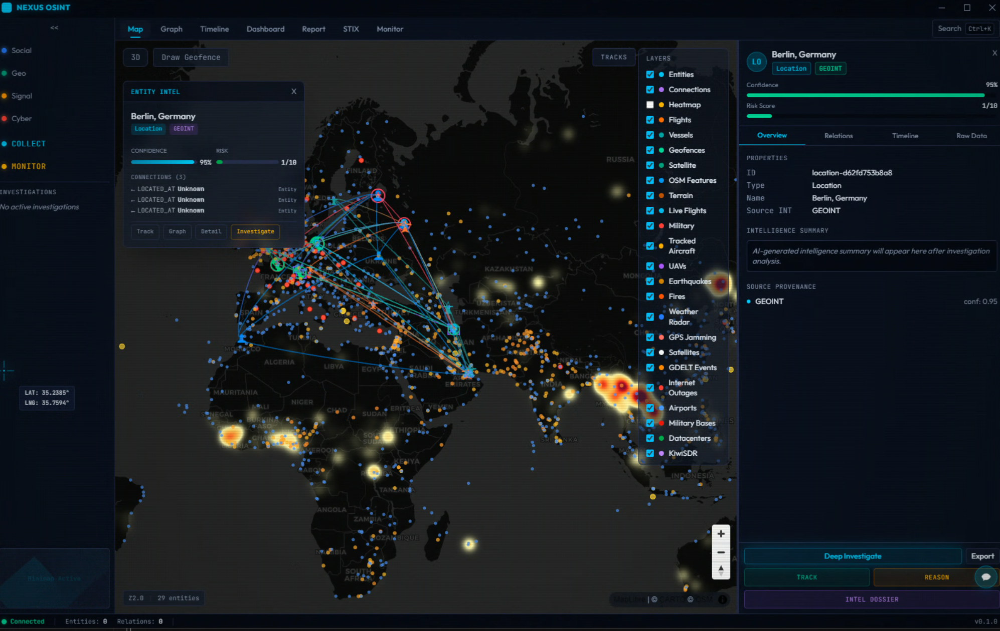
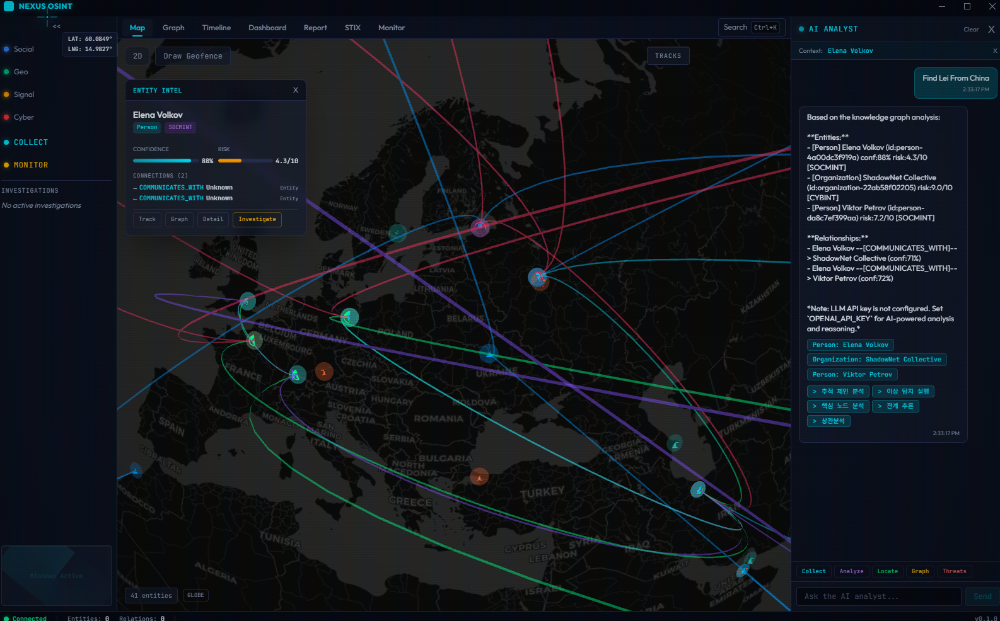

<p align="center">
  <h1 align="center">NEXUS</h1>
  <p align="center"><strong>Network EXploration & Unified Synthesis</strong></p>
  <p align="center">Multi-INT Fusion OSINT Platform</p>
</p>

<p align="center">
  <a href="#quick-start">Quick Start</a> &nbsp;&bull;&nbsp;
  <a href="#architecture">Architecture</a> &nbsp;&bull;&nbsp;
  <a href="#features">Features</a> &nbsp;&bull;&nbsp;
  <a href="#live-feed-system">Live Feed</a> &nbsp;&bull;&nbsp;
  <a href="CONTRIBUTING.md">Contributing</a>
</p>

<p align="center">
  
  
  
  
  
  
  
</p>

<p align="center">
  <a href="README.md">English</a> &nbsp;|&nbsp;
  <a href="docs/README_ko.md">한국어</a> &nbsp;|&nbsp;
  <a href="docs/README_zh.md">中文</a> &nbsp;|&nbsp;
  <a href="docs/README_ja.md">日本語</a>
</p>

---

<p align="center">
  <a href="pics/osint_demo.mp4">
    
  </a>
  <br>
  <em>▶ Click the image above to watch the demo video — Real-time Multi-INT OSINT fusion with 30+ live data sources</em>
</p>

---

**NEXUS** is a professional-grade Multi-INT (Multiple Intelligence) fusion platform for Open Source Intelligence (OSINT) operations. It unifies **CYBINT**, **SOCMINT**, **SIGINT**, and **GEOINT** collection, processing, analysis, and visualization into a single desktop application backed by a knowledge graph — with a **real-time live feed engine** that streams 30+ OSINT data sources directly to an interactive map.

<p align="center">
  
  <br>
  <em>2D Map View — Global entity network visualization with Deck.gl multi-layer rendering</em>
</p>

<p align="center">
  
  <br>
  <em>AI Analyst — RAG-powered knowledge graph querying and intelligence analysis</em>
</p>

---

## Quick Start

### Prerequisites

| Tool | Version | Installation |
|------|---------|-------------|
| Node.js | 20+ | [nodejs.org](https://nodejs.org) |
| pnpm | 9+ | `npm install -g pnpm` |
| Python | 3.12+ | [python.org](https://python.org) |
| uv | latest | `pip install uv` |
| Docker | 24+ | [docker.com](https://docker.com) |

### 3 Commands to Run

```bash
# 1. Start infrastructure (Neo4j, PostgreSQL, Redis, Elasticsearch, Kafka, MinIO, Prometheus, Grafana)
cd infra && docker compose up -d

# 2. Start backend (API server + live feed collection — no Celery worker needed)
cd apps/api
uv pip install --system .
JWT_SECRET=your-secret-key-here uvicorn nexus.main:sio_asgi_app --reload --host 0.0.0.0 --port 8000

# 3. Start frontend (Electron + React desktop app)
cd apps/desktop
pnpm install
pnpm dev
```

> **That's it.** The live feed scheduler runs inside the API process — no separate Celery worker required. Open `http://localhost:5173` and data will start flowing automatically.

### Environment Setup

```bash
cp .env.example .env
# Edit .env with your API keys and a strong JWT_SECRET
```

`JWT_SECRET` is **required** — the server will refuse to start without it.

---

## Features

### Intelligence Collection (Multi-INT)

| Discipline | Capability | Sources |
|:---:|---|---|
| **CYBINT** | IP/Domain reconnaissance, threat intelligence, vulnerability analysis | Shodan, VirusTotal, AbuseIPDB, OTX, SecurityTrails, Certificate Transparency |
| **SOCMINT** | Social media account analysis, network mapping | Twitter/X API, platform-specific collectors |
| **SIGINT** | Aircraft tracking (ADS-B), vessel monitoring (AIS), satellite tracking (TLE/SGP4), RF signal analysis | OpenSky Network, ADS-B Exchange (adsb.lol, adsb.fi, airplanes.live), CelesTrak |
| **GEOINT** | Geospatial intelligence, satellite imagery, terrain analysis | Mapbox, OpenStreetMap, CesiumJS terrain providers |

### Live Feed System

NEXUS includes a **real-time OSINT collection engine** running as an in-process background scheduler that continuously streams 30+ data sources onto the map and dashboard:

| Category | Sources | Update Interval |
|----------|---------|:---:|
| **Aircraft** | ADS-B Exchange (adsb.lol — 6 global regions), OpenSky Network (OAuth2 gap-fill), airplanes.live, adsb.fi | 60s |
| **Military** | Military transponders, UAV detection, Plane Alert DB (VIP aircraft enrichment) | 60s |
| **Satellites** | CelesTrak TLE + SGP4 real-time propagation (intel classification) | 60s |
| **News** | 19 configurable RSS feeds (BBC, NPR, AlJazeera, GDACS, NHK, etc.) with geocoding + risk scoring (0–10) | 5min |
| **Earthquakes** | USGS 2.5+ magnitude, last 24 hours | 5min |
| **Fires** | NASA FIRMS NOAA-20 VIIRS hotspots (top 5,000 by FRP) | 5min |
| **Weather** | RainViewer radar tiles | 5min |
| **Space Weather** | NOAA SWPC Kp index + solar events | 5min |
| **Geopolitics** | GDELT 2.0 conflict events, DeepStateMap frontlines | 5min |
| **Infrastructure** | IODA internet outages, KiwiSDR radio receivers | 5min |
| **Reference** | Global airports, military bases, datacenters, power plants | 5min |
| **Defense Stocks** | RTX, LMT, NOC, GD, BA, PLTR via yfinance | 5min |
| **Oil Prices** | WTI Crude, Brent Crude | 5min |
| **Radio** | Broadcastify top feeds, OpenMHz trunked radio systems | On-demand |

The live feed runs as an **in-process asyncio background scheduler** inside the API server — no external workers needed. Two-tier collection: **Fast tier** (60s) for flights, military, satellites and **Slow tier** (5min) for everything else.

### Knowledge Graph (POLE Schema)

- **24 Entity Types**: Person, Organization, IPAddress, Domain, Certificate, ThreatActor, Malware, Vulnerability, Vessel, Aircraft, SocialAccount, Location, Event, and more
- **20+ Relationship Types**: `RESOLVES_TO`, `HOSTS`, `ATTRIBUTED_TO`, `LOCATED_AT`, `TARGETS`, `COMMUNICATES_WITH`, `ORIGINATES_FROM`, `TERMINATES_AT`, `OCCURRED_AT`, etc.
- **Live-to-Graph Persistence**: High-risk news (score >= 6), major earthquakes (M >= 4.0), and tracked aircraft are automatically persisted to Neo4j for AI analysis
- **Graph algorithms**: Louvain community detection, betweenness/PageRank centrality, shortest path analysis via Neo4j GDS

### AI Analyst

- RAG (Retrieval-Augmented Generation) chat engine with intent classification
- **Real-time context**: AI has access to live feed data (current news, tracked aircraft, earthquakes, GPS jamming) alongside the knowledge graph
- Natural language querying of entities, relationships, and live intelligence
- Automated entity path analysis and relationship summarization
- VIP dossier generation and alert-based intelligence reports

### Visualization

- **2D Map**: Deck.gl + MapLibre GL JS with 20+ live feed layers (flights, military, satellites, earthquakes, fires, weather radar, GPS jamming, GDELT, airports, military bases, datacenters, KiwiSDR)
- **3D Globe**: CesiumJS for full 3D globe visualization with entity placement and flight/vessel track replay
- **Graph View**: Sigma.js (graphology) for interactive entity relationship graph with community-based coloring
- **Dashboard**: Real-time widgets — defense stocks, oil prices, space weather, live feed status, threat intercept feed, anomaly detection, community insights
- **News Panel**: Risk-scored global news overlay with spatial clustering (4° grid), source filtering, and auto-scroll for high-risk events
- **Timeline**: Chronological event playback with entity filtering

### Intelligence Grading

All collected intelligence is graded using the **NATO Admiralty System**:
- **Reliability** (A–F): Source trustworthiness
- **Credibility** (1–6): Information credibility

### Report Generation

- Multi-format export: PDF, HTML, JSON, STIX 2.1
- Customizable report templates
- STIX 2.1 interoperability for threat intelligence sharing

---

## Architecture

```
┌─────────────────────────────────────────────────────────────────────────┐
│                        PRESENTATION LAYER                              │
│         Electron 33 + React 19 + TailwindCSS 4 + Zustand              │
│    ┌──────────┬──────────┬───────────┬───────────┬──────────┐          │
│    │  2D Map  │ 3D Globe │   Graph   │ Dashboard │ Timeline │          │
│    │ Deck.gl  │ CesiumJS │ Sigma.js  │ Recharts  │          │          │
│    │ +20 live │          │           │ +Widgets  │          │          │
│    │  layers  │          │           │           │          │          │
│    └──────────┴──────────┴───────────┴───────────┴──────────┘          │
└────────────────────────────┬────────────────────────────────────────────┘
                             │ REST / WebSocket / GraphQL
┌────────────────────────────┴────────────────────────────────────────────┐
│                          API GATEWAY                                    │
│              FastAPI + Socket.IO + Strawberry GraphQL                   │
│         JWT Auth │ Rate Limiting │ Audit Logging │ Prometheus           │
│                                                                         │
│   ┌─────────────────────────────────────────────────────────┐          │
│   │  IN-PROCESS LIVE FEED SCHEDULER (no Celery needed)      │          │
│   │  Fast tier (60s): flights, military, satellites          │          │
│   │  Slow tier (5m): news, earthquakes, fires, stocks, ...  │          │
│   └─────────────────────────────────────────────────────────┘          │
└──────┬─────────┬──────────┬──────────┬──────────┬──────────────────────┘
       │         │          │          │          │
┌──────┴──┐ ┌────┴───┐ ┌───┴────┐ ┌───┴───┐ ┌───┴────┐
│  Neo4j  │ │  PgSQL │ │ Redis  │ │  ES   │ │ Kafka  │
│  (KG)   │ │ 17     │ │  7.x   │ │ 8.x   │ │  3.7   │
└─────────┘ └────────┘ └────────┘ └───────┘ └────────┘
```

### Two Data Paths

**1. Collection Pipeline** (query-based, fully persistent):
```
API Request → Collector.collect() → entity_factory → Neo4j + PostgreSQL + Elasticsearch
```

**2. Live Feed Pipeline** (scheduled, real-time):
```
In-process Scheduler (60s/300s) → 30+ OSINT Sources → Redis (TTL) → WebSocket push → Frontend
                                                     → [selective] Neo4j (tracked aircraft, high-risk news, major quakes)
```

Live data stays in Redis by default — only notable items are persisted to the knowledge graph:
- **Tracked aircraft** (from Plane Alert DB)
- **High-risk news** (risk score >= 6)
- **Significant earthquakes** (magnitude >= 4.0)

---

## Tech Stack

| Layer | Technology |
|:---:|---|
| **Frontend** | Electron 33, React 19, TypeScript 5.7, TailwindCSS 4, Zustand, TanStack Query v5 |
| **Visualization** | Deck.gl v9 + MapLibre GL JS (2D), CesiumJS (3D Globe), Sigma.js (Graph), Recharts |
| **Backend** | Python 3.12, FastAPI, Strawberry GraphQL, Socket.IO, Pydantic v2 |
| **Knowledge Graph** | Neo4j 5.x + GDS (Graph Data Science) + APOC + n10s |
| **Databases** | PostgreSQL 17 (pgvector + TimescaleDB), Elasticsearch 8.x, Redis 7.x |
| **Messaging** | Apache Kafka 3.7 |
| **Storage** | MinIO (S3-compatible object storage) |
| **ML/NLP** | HuggingFace Transformers, GLiNER (NER), SGP4 (satellite propagation) |
| **Monitoring** | Prometheus + Grafana |
| **Live Feed** | ADS-B Exchange (4 sources), OpenSky, CelesTrak/SGP4, USGS, NASA FIRMS, GDELT, IODA, RainViewer, NOAA SWPC, yfinance, Broadcastify, OpenMHz |
| **Build** | Turborepo, pnpm 9 (frontend), uv (backend) |

---

## Project Structure

```
nexus-msint/
├── apps/
│   ├── api/                        # FastAPI backend (Python 3.12+)
│   │   ├── nexus/
│   │   │   ├── api/                # REST routes, GraphQL, WebSocket handlers
│   │   │   ├── collectors/
│   │   │   │   ├── cybint/         #   CYBINT (Shodan, VT, AbuseIPDB, OTX, ST)
│   │   │   │   ├── socmint/        #   SOCMINT (Twitter/X)
│   │   │   │   ├── sigint/         #   SIGINT (ADS-B multi-source, AIS, military,
│   │   │   │   │                   #     satellite tracking)
│   │   │   │   ├── geoint/         #   GEOINT (Sentinel-2, geocoding)
│   │   │   │   └── osint_feeds/    #   Live feeds (news, satellites, earthquakes,
│   │   │   │                       #     fires, stocks, GDELT, radio, infrastructure)
│   │   │   ├── knowledge/          # Neo4j client, repository, graph algorithms,
│   │   │   │                       #   reasoning engine, ontology bridge, SHACL
│   │   │   ├── models/             # Pydantic v2 models (POLE entities, live feed, news)
│   │   │   ├── processing/         # NER pipeline (GLiNER), entity factory, fusion,
│   │   │   │                       #   geolocation, entity resolution
│   │   │   ├── services/           # Chat engine (RAG), live store, plane alert,
│   │   │   │                       #   flight analytics, news config, dossier engine,
│   │   │   │                       #   alert engine, vector search
│   │   │   ├── tasks/              # Celery tasks + live feed scheduler
│   │   │   └── utils/              # Logging, rate limiting, HTTP client
│   │   ├── config/                 # RSS feed configuration (19 feeds)
│   │   ├── data/                   # Plane Alert DB, satellite TLE cache,
│   │   │                           #   military bases, datacenters, power plants
│   │   └── tests/                  # pytest test suite
│   └── desktop/                    # Electron + React desktop application
│       ├── electron/               # Main process, preload, IPC, security
│       └── src/
│           ├── components/
│           │   ├── map/            # Deck.gl layers (flights, earthquakes, fires,
│           │   │                   #   satellites, infrastructure, GPS jamming)
│           │   ├── news/           # News feed panel + RSS config
│           │   ├── dashboard/      # Widgets (stocks, oil, space weather, status,
│           │   │                   #   anomaly detection, community insights)
│           │   ├── graph/          # Sigma.js entity graph
│           │   └── ...             # Timeline, chat, reports, monitoring
│           ├── stores/             # Zustand (app, entity, map, collection,
│           │                       #   liveFeed, monitoring, chat, graph, report)
│           ├── services/           # API client, WebSocket client
│           └── types/              # TypeScript type definitions
├── packages/
│   └── shared-types/               # Shared TypeScript types
├── infra/                          # Docker Compose, Neo4j schema, Kafka topics
├── ontology/                       # OWL/RDF ontology (POLE, STIX mappings)
├── docs/                           # Documentation & i18n README files
└── pics/                           # Screenshots & demo video
```

---

## API Keys

Configure in `.env` — all are optional. Unconfigured collectors are disabled; the live feed engine works without any API keys (uses free public APIs).

| Discipline | Service | Environment Variable |
|:---:|---------|---------------------|
| CYBINT | Shodan | `SHODAN_API_KEY` |
| CYBINT | VirusTotal | `VIRUSTOTAL_API_KEY` |
| CYBINT | AbuseIPDB | `ABUSEIPDB_API_KEY` |
| CYBINT | AlienVault OTX | `OTX_API_KEY` |
| CYBINT | SecurityTrails | `SECURITYTRAILS_API_KEY` |
| SOCMINT | Twitter/X | `TWITTER_BEARER_TOKEN` |
| SIGINT | OpenSky (gap-fill) | `OPENSKY_CLIENT_ID`, `OPENSKY_CLIENT_SECRET` |
| GEOINT | Mapbox | `MAPBOX_ACCESS_TOKEN` |
| AI | OpenAI | `OPENAI_API_KEY` |

---

## Infrastructure Services

| Service | Port | Dashboard |
|---------|------|-----------|
| FastAPI | 8000 | `http://localhost:8000/docs` |
| Neo4j Browser | 7474 | `http://localhost:7474` |
| PostgreSQL | 5432 | — |
| Redis | 6379 | — |
| Elasticsearch | 9200 | — |
| Kafka | 9092 | — |
| MinIO Console | 9001 | `http://localhost:9001` |
| Prometheus | 9090 | `http://localhost:9090` |
| Grafana | 3000 | `http://localhost:3000` |

---

## Development

### Backend

```bash
cd apps/api
ruff check nexus/           # Lint
ruff format nexus/           # Format
pyright                      # Type check
JWT_SECRET=test pytest -v    # Test
```

### Frontend

```bash
cd apps/desktop
pnpm lint                    # ESLint
pnpm typecheck               # TypeScript check
pnpm build                   # Full build (tsc + Vite + electron-builder)
```

### Monorepo

```bash
pnpm install                 # Install all workspaces
pnpm build                   # Turborepo: build all
pnpm lint                    # Turborepo: lint all
pnpm format                  # Prettier: format all
```

---

## Contributing

We welcome contributions from the community! Please read our [Contributing Guide](CONTRIBUTING.md) for details on code of conduct, development workflow, coding standards, and PR process.

---

## License

This project is licensed under the **MIT License** — see the [LICENSE](LICENSE) file for details.

---

<p align="center">
  <strong>NEXUS</strong> — Unifying multi-source intelligence into actionable insight.
</p>
