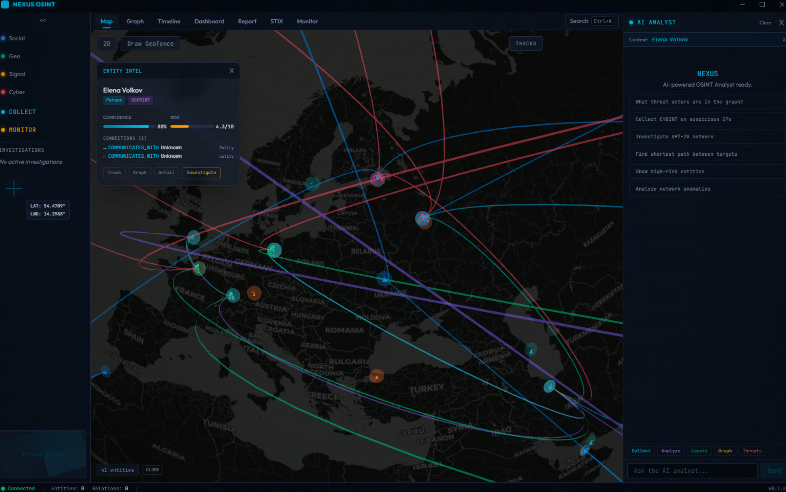

<p align="center">
  <h1 align="center">NEXUS</h1>
  <p align="center"><strong>Network EXploration & Unified Synthesis</strong></p>
  <p align="center">Multi-INT Fusion OSINT Platform</p>
</p>

<p align="center">
  
  
  
  
  
  
  
</p>

<p align="center">
  <a href="../README.md">English</a> &nbsp;|&nbsp;
  <a href="README_ko.md">한국어</a> &nbsp;|&nbsp;
  <a href="README_zh.md">中文</a> &nbsp;|&nbsp;
  <a href="README_ja.md"><strong>日本語</strong></a>
</p>

---

**NEXUS** は、プロフェッショナルグレードの Multi-INT（マルチインテリジェンス）融合 OSINT（オープンソースインテリジェンス）プラットフォームです。**CYBINT**、**SOCMINT**、**SIGINT**、**GEOINT** の収集、処理、分析、可視化をナレッジグラフベースの単一デスクトップアプリケーションに統合します。

<p align="center">
  
  <br>
  <em>2D マップビュー — Deck.gl マルチレイヤーレンダリングによるグローバルエンティティネットワーク可視化</em>
</p>

<p align="center">
  
  <br>
  <em>3D グローブビュー — リアルタイム接続分析を含むエンティティ検査</em>
</p>

<p align="center">
  
  <br>
  <em>AI アナリスト — RAG ベースのナレッジグラフクエリとインテリジェンス分析</em>
</p>

---

## 概要

NEXUS は、マルチソースインテリジェンスデータの収集、相関分析、可視化を必要とするインテリジェンスアナリスト、セキュリティ研究者、調査チーム向けに設計されています。さまざまなデータソースからナレッジグラフを自動構築し、グラフアルゴリズムにより隠れた関係を特定し、2D/3D 地理空間可視化と AI 支援分析を提供します。

### NEXUS の主要機能

- **収集**：4つの INT 分野にわたる 15 以上の OSINT ソースからインテリジェンスを収集
- **正規化**：生データを統一された POLE（人物-オブジェクト-場所-イベント）オントロジーに変換
- **相関分析**：グラフアルゴリズム（コミュニティ検出、中心性分析、経路探索）によるエンティティ相関
- **可視化**：インタラクティブな 2D マップ（Deck.gl）と 3D グローブ（CesiumJS）での関係可視化
- **分析**：AI 駆動の RAG チャットエンジンによる自然言語データクエリ
- **監視**：自動化されたウォッチリストとリアルタイムアラートによるターゲット監視
- **エクスポート**：PDF、HTML、JSON、STIX 2.1 形式のインテリジェンス成果物を生成

---

## 主要機能

### インテリジェンス収集 (Multi-INT)

| 分野 | 機能 | ソース |
|:---:|---|---|
| **CYBINT** | IP/ドメイン偵察、脅威インテリジェンス、脆弱性分析 | Shodan, VirusTotal, AbuseIPDB, OTX, SecurityTrails, CT |
| **SOCMINT** | ソーシャルメディアアカウント分析、ネットワークマッピング | Twitter/X API, プラットフォーム固有コレクター |
| **SIGINT** | 航空機追跡(ADS-B)、船舶監視(AIS)、RF 信号分析 | OpenSky Network, ADS-B Exchange, AIS フィード |
| **GEOINT** | 地理空間インテリジェンス、衛星画像、地形分析 | Mapbox, OpenStreetMap, CesiumJS 地形プロバイダー |

### ナレッジグラフ (POLE スキーマ)

- **24 エンティティタイプ**：Person, Organization, IPAddress, Domain, Certificate, ThreatActor, Malware, Vulnerability, Vessel, Aircraft, SocialAccount, Location, Event など
- **20 関係タイプ**：`RESOLVES_TO`, `HOSTS`, `ATTRIBUTED_TO`, `LOCATED_AT`, `TARGETS`, `COMMUNICATES_WITH` など
- **メタデータリッチなエッジ**：すべての関係に信頼度スコア、ソース INT タイプ、タイムスタンプ、収集方法を含む
- **グラフアルゴリズム**：Neo4j GDS による Louvain コミュニティ検出、媒介中心性/PageRank、最短経路分析

### 可視化

- **2D マップ**：Deck.gl + MapLibre GL JS — アーク、散布図、ヒートマップ、等高線、GeoJSON、地形レイヤー
- **3D グローブ**：CesiumJS — エンティティ配置と飛行/船舶軌跡再生を含む 3D グローブ
- **グラフビュー**：Sigma.js (graphology) — コミュニティベースの色分けを含むインタラクティブなエンティティ関係グラフ
- **ダッシュボード**：Recharts ベースのリアルタイム分析 — 収集統計、エンティティ分布、時系列分析
- **タイムライン**：エンティティフィルタリングを含む時系列イベント再生

### AI アナリスト

- インテント分類を含む RAG（検索拡張生成）チャットエンジン
- 根拠ある回答のための Neo4j + PostgreSQL コンテキスト検索
- ナレッジグラフの自然言語クエリ
- 自動化されたエンティティパス分析と関係要約

### インテリジェンス格付け (NATO Admiralty System)

- **信頼性** (A–F)：ソースタイプと過去の精度に基づくソースの信頼度
- **確実性** (1–6)：クロスソース裏付け、一貫性、最新性に基づく情報の確実度

---

## アーキテクチャ

```
┌─────────────────────────────────────────────────────────────────────────┐
│                       プレゼンテーション層                                 │
│         Electron 33 + React 19 + TailwindCSS 4 + Zustand              │
│    ┌──────────┬──────────┬───────────┬───────────┬──────────┐          │
│    │ 2D マップ │3D グローブ│   グラフ   │ ダッシュボード│タイムライン│          │
│    │ Deck.gl  │ CesiumJS │ Sigma.js  │ Recharts  │          │          │
│    └──────────┴──────────┴───────────┴───────────┴──────────┘          │
└────────────────────────────┬────────────────────────────────────────────┘
                             │ REST / WebSocket / GraphQL
┌────────────────────────────┴────────────────────────────────────────────┐
│                        API ゲートウェイ                                   │
│              FastAPI + Socket.IO + Strawberry GraphQL                   │
│        JWT 認証 │ レート制限 │ 監査ログ │ Prometheus                       │
└──────┬─────────┬──────────┬──────────┬──────────┬──────────────────────┘
       │         │          │          │          │
┌──────┴──┐ ┌────┴───┐ ┌───┴────┐ ┌───┴───┐ ┌───┴────┐
│  Neo4j  │ │  PgSQL │ │ Redis  │ │  ES   │ │ Kafka  │
│  (KG)   │ │ 17     │ │  7.x   │ │ 8.x   │ │  3.7   │
└─────────┘ └────────┘ └────────┘ └───────┘ └────────┘
```

---

## 技術スタック

| レイヤー | 技術 |
|:---:|---|
| **フロントエンド** | Electron 33, React 19, TypeScript 5.7, TailwindCSS 4, Zustand, TanStack Query v5 |
| **可視化** | Deck.gl v9 + MapLibre GL JS (2D), CesiumJS (3D), Sigma.js (グラフ), Recharts |
| **バックエンド** | Python 3.12, FastAPI, Strawberry GraphQL, Socket.IO, Celery, Pydantic v2 |
| **ナレッジグラフ** | Neo4j 5.x + GDS + APOC + n10s |
| **データベース** | PostgreSQL 17 (pgvector + TimescaleDB), Elasticsearch 8.x, Redis 7.x |
| **メッセージング** | Apache Kafka 3.7 |
| **ストレージ** | MinIO（S3 互換オブジェクトストレージ） |
| **モニタリング** | Prometheus + Grafana |
| **ビルド** | Turborepo, pnpm 9（フロントエンド）, uv（バックエンド） |

---

## クイックスタート

### 前提条件

| ツール | バージョン | 用途 |
|--------|-----------|------|
| Node.js | 20+ | フロントエンドランタイム |
| pnpm | 9+ | フロントエンドパッケージマネージャー |
| Python | 3.12+ | バックエンドランタイム |
| uv | 最新版 | Python パッケージマネージャー |
| Docker | 24+ | インフラストラクチャサービス |
| Docker Compose | v2+ | サービスオーケストレーション |

### 1. クローンと設定

```bash
git clone https://github.com/your-org/nexus-msint.git
cd nexus-msint
cp .env.example .env
# .env ファイルに API キーを設定してください
```

### 2. インフラストラクチャの起動

```bash
cd infra
docker compose up -d
```

### 3. バックエンドの起動

```bash
cd apps/api
uv pip install --system .
uvicorn nexus.main:sio_asgi_app --reload --host 0.0.0.0 --port 8000
```

### 4. フロントエンドの起動

```bash
cd apps/desktop
pnpm install
pnpm dev
```

### 5. テストの実行

```bash
cd apps/api
JWT_SECRET=test-secret pytest
```

---

## コントリビューション

コミュニティからの貢献を歓迎します！詳細は[コントリビューションガイド](../CONTRIBUTING.md)をご覧ください。

## ライセンス

このプロジェクトは **MIT ライセンス** の下でライセンスされています — 詳細は [LICENSE](../LICENSE) ファイルをご覧ください。

---

<p align="center">
  <strong>NEXUS</strong> — マルチソースインテリジェンスを実用的なインサイトに統合します。
</p>
